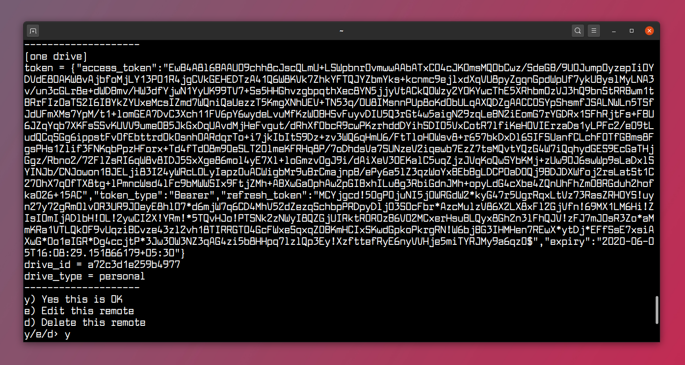

#RClone with OneDrive

This is a guide to install and setup rclone for use with OneDrive on Ubuntu 22.04

###Step 1
Install RClone with apt

```bash
sudo apt install rclone
```

###Step 2
Add new remote

```bash
rclone config
```

###Step 3
RClone will ask if you want to create a new config using defaults
select n


###Step 4
Now select a name for the new remote


###Step 5
Select the cloud service you'd like to connect to.  (when I ran it last, OneDrive was option 22)


###Step 6
After selecting the cloud service, it will ask if you want to enter a client ID or a secret ID, this can be ignored by hitting Enter twice.

###Step 7
Next it will ask if you'd like to perform any advanced configuration, press n for no


###Step 8
Finally, it will ask about using the auto config.  Press Y to do so

###Step 9
After the auto config completes, your default browser will open and require you in login to your Microsoft account and grant rclone permission to access it.


###Step 10
Now back in your terminal session, rclone will ask you what type of OneDrive account you have to connect to.  Option 1 is IneDrive Personal or Business, which should be the correct option for most circumstances.


###Step 11
After selecting personal, you'll need to chose the drive to use.  In most cases, it should be 0.


###Step 12
Then, you'll need to confirm the settings are correct.



###Step 13
Finally, you'll need to close the configurator by pressing q.


###Step 14
Now that rclone has been configured to use OneDrive, you'll need to make a OneDrive directory in your home folder, and set rclone to mount OneDrive everytime you log inthrough the "Startup Applications" where the command is as follows.

```bash
sh -c "rclone --vfs-cache-mode writes mount \"OneDrive\": ~/OneDrive"
```


###references
this was taken from https://itsfoss.com/use-onedrive-linux-rclone/

